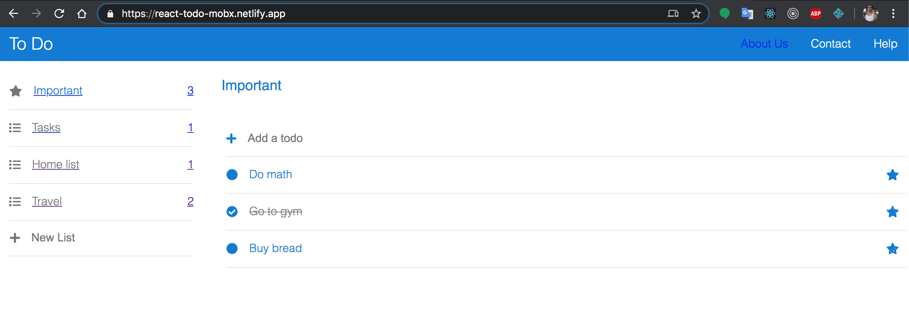

# react-todo-mobx

Live demonstration at:
https://react-todo-mobx.netlify.app/

To Do is a simple and intelligent to-do list that lets you manage all your tasks in one place. You can work through your tasks for the day in My Day and create any number of additional lists to organize your Work, Groceries, Travel, Shopping, Movies to Watch - you get the idea!  

In each list you can add as many tasks as you like. Keep everything on track by setting due dates and reminders for each task and starring your most important to-dos. Use steps to break down your larger tasks in to more manageable pieces and notes to record extra details.

Created with CodeSandbox
